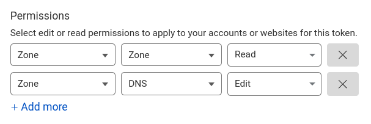

# Cloudflare Provider

If you are using [Cloudflare](https://www.cloudflare.com/) as your DNS provider, you can use the Cloudflare provider to obtain and renew certificates.

## Required Provider Options

```yaml
provider: cloudflare

provider_options:
  api_token: YOUR_API_TOKEN
```

- `provider: cloudflare` - This has to be set to `cloudflare` to use the Cloudflare provider.
- `provider_options.api_token` - This is the API token that will be used to authenticate with the Cloudflare API.

## How to Obtain the API Token

Head over to the [Cloudflare API Tokens](https://dash.cloudflare.com/profile/api-tokens) page and create a new API token.

1. Click on the "Create Token" button.
2. Go to the bottom and click "Get started" next to "Create Custom Token".
3. Give the token a suitable name.
4. Give the following permissions:

5. Under "Zone Resources", select the zones that you want to use with the application. All domains that are managed by the application have to be included in the zones.
6. Set a reasonable expiration date for the token under "TTL".